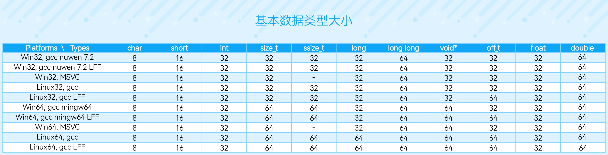
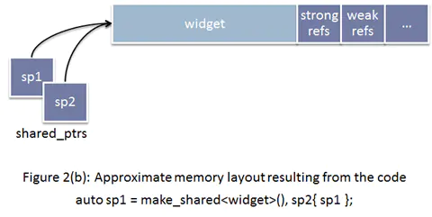

# C++笔记

在写了在写了。~~新建文件夹~~

### 各平台下C/C++基本数据类型大小



### 关于const作用范围与constexp


不管const写成如何，读懂别人写的const和*满天飞的类型的金科玉律是**const默认作用于其左边的东西，否则作用于其右边的东西：**

> const applies to the thing left of it. If there is nothing on the left then it applies to the thing right of it.[1]

例如，

> const int* 

const只有右边有东西，所以const修饰int成为常量整型，然后*再作用于常量整型。所以这是a pointer to a constant integer（指向一个整型，不可通过该指针改变其指向的内容，但可改变指针本身所指向的地址）

> int const *

再看这个，const左边有东西，所以const作用于int，*再作用于int const所以这还是 a pointer to a constant integer（同上）

> int* const 

这个const的左边是*，所以const作用于指针（不可改变指向的地址），所以这是a constant pointer to an integer，可以通过指针改变其所指向的内容但只能指向该地址，不可指向别的地址。

> const int* const

这里有两个const。左边的const 的左边没东西，右边有int那么此const修饰int。右边的const作用于*使得指针本身变成const（不可改变指向地址），那么这个是a constant pointer to a constant integer，不可改变指针本身所指向的地址也不可通过指针改变其指向的内容。

作者：王国潇
链接：https://www.zhihu.com/question/443195492/answer/1723886545


### 关于C语言中变长参数的实现

我们查看`stdarg.h`的源码，发现`va_list`其实就是字符型指针(From Visual Studio)：

```
typedef char * va_list;
```

这里不要和字符串混淆，设置字符型指针是因为`char`的大小正好是一个字节，我们接着往下看：

```
// stdarg.h
#define va_start _crt_va_start
#define va_arg _crt_va_arg
#define va_end _crt_va_end
// vadefs.h
typedef char *  va_list;
#define _crt_va_start(ap,v)  ( ap = (va_list)_ADDRESSOF(v) + _INTSIZEOF(v) )
#define _crt_va_arg(ap,t)    ( *(t *)((ap += _INTSIZEOF(t)) - _INTSIZEOF(t)) )
#define _crt_va_end(ap)      ( ap = (va_list)0 )
#define _ADDRESSOF(v)   ( &(v) )
#define _INTSIZEOF(n)   ( (sizeof(n) + sizeof(int) - 1) & ~(sizeof(int) - 1) )
```

`_ADDRESSOF(v)`就是变量`v`的地址，那么`_INTSIZEOF`怎么理解？设`sizeof(n)`为ss，那么该宏展开就是f(s)=(s+3)&(∼3)f(s)=(s+3)&(∼3)，∼3∼3的二进制表示为111…11100111…11100，任何数和它相与都会成为44的倍数，也就是前两位为00. 为何要加上33？那是为了实现**字节对齐**：无论是32位还是64位机器，`sizeof(int)`，也就是4字节，永远是机器的位数，f(s)f(s)使得对任意类型的变量，都能实现字节对齐：

f(s)=⌈s4⌉f(s)=⌈s4⌉

了解了这两个关键宏之后，我们来看看其他宏的作用.

`va_start`将已知参数压入栈（如上面`double sum(int num, ...)`中的`num`）,设置指针指向已知参数的后面：

| 每一块都 是4字节 | 固定参数 所在字节块 |                                       |      |      |      |      |      |      |      |      |
| :--------------: | :-----------------: | :------------------------------------ | :--: | :--: | :--: | :--: | :--: | :--: | :--: | :--: |
|        …         |         num         | ←←指针指向的位置 也就是该字节的起始点 |      |      |      |      |      |      |      |      |

`va_arg(ap, t)`“返回”以`ap`为起始地址的`_INTSIZEOF(t)`个字节内容转换为`t`型数据，同时`ap`跳到后面，准备处理第二个参数：假设第一个参数为`int`：

| 每一块都是 一字节 | 固定参数 所在字节块 | 第一个参数(int) |                                       |      |      |      |      |      |      |      |
| :---------------: | :-----------------: | :-------------: | :-----------------------------------: | :--: | :--: | :--: | :--: | :--: | :--: | :--: |
|         …         |         num         |                 | ←←指针指向的位置 也就是该字节的起始点 |      |      |      |      |      |      |      |

如果是小于4字节的参数，比如`short`，`char`，根据`_INTSIZEOF`宏的定义，我们知道`ap`还是会进行`4`字节的自增：

| 每一块都是 4字节 | 固定参数 所在字节块 | 第一个参数(char) |                                       |      |      |      |      |      |      |      |
| :--------------: | :-----------------: | :--------------: | :-----------------------------------: | :--: | :--: | :--: | :--: | :--: | :--: | :--: |
|        …         |         num         |                  | ←←指针指向的位置 也就是该字节的起始点 |      |      |      |      |      |      |      |

对于大于4字节的数据类型，比如`double`（8字节），`ap`就会调整自增的步长：

| 每一块都是 4字节 | 固定参数 所在字节块 | 第一个参数(int) | 第二个参数(double) | 这里也属于 第二个参数 |                                       |      |      |      |      |      |
| :--------------: | :-----------------: | :-------------: | :----------------: | :-------------------: | :-----------------------------------: | :--: | :--: | :--: | :--: | :--: |
|        …         |         num         |                 |                    |                       | ←←指针指向的位置 也就是该字节的起始点 |      |      |      |      |      |

> 借此我们也可以推理出，CC中的`"..."`语法在底层上的处理和定长普通参数相同，都是将这些参数压入栈.

最后，`va_end`将指针赋值为`NULL`，作为结束.

[可变长参数方法汇总 - 邢存远的博客 | Welt Xing's Blog (welts.xyz)](https://welts.xyz/2021/04/10/varargs/)

### 关于C++ shared_ptr 

```cpp
int* p = new int();
std::shared_ptr<int> sp1(p);
std::shared_ptr<int> sp2(sp1);
std::shared_ptr<int> sp3(p);
```

此时sp1和sp2引用数为2，sp3引用数为1，可能出现重复释放的问题

为了解决这一问题，出现了make_shared函数

使用默认构造函数，内存模型如下



使用make_shared ，内存模型如下


 这样一来不仅提高了访问速度，而且解决了先前引用计数不正确的错误。

但是又引入了一个问题，使用make_shared函数创建的对象生存周期将被weak_ptr延长。这样就违背了weak_ptr的设计初衷。

- If any [std::weak_ptr](https://en.cppreference.com/w/cpp/memory/weak_ptr) references the control block created by after the lifetime of all shared owners ended, the memory occupied by persists until all weak owners get destroyed as well, which may be undesirable if is large. `std::make_shared``T``sizeof(T)`

[std::make_shared, std::make_shared_for_overwrite - cppreference.com](https://en.cppreference.com/w/cpp/memory/shared_ptr/make_shared)

