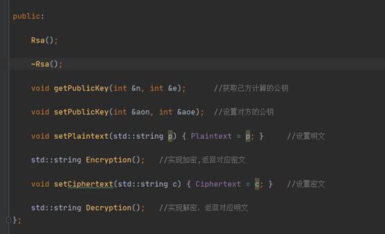
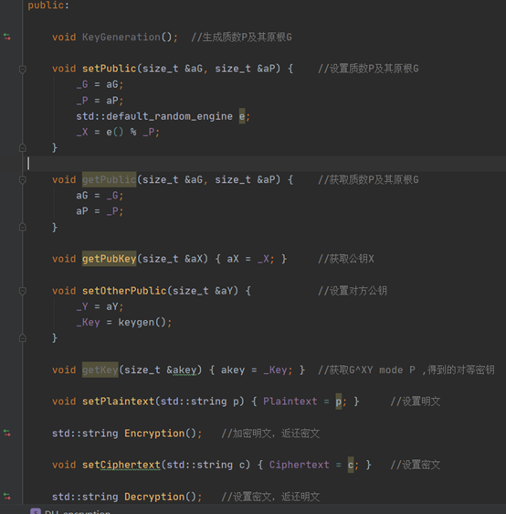
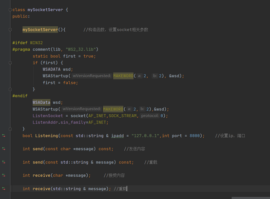
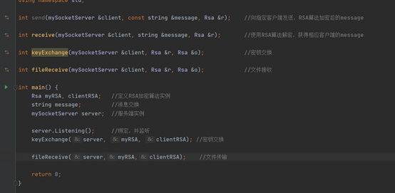
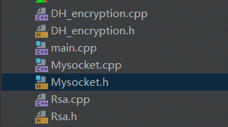
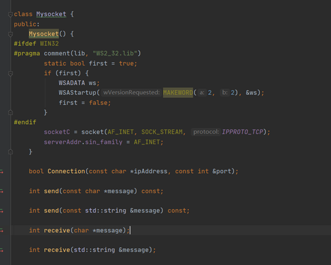
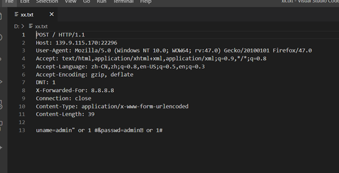
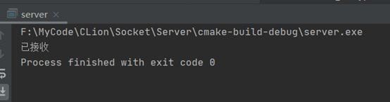
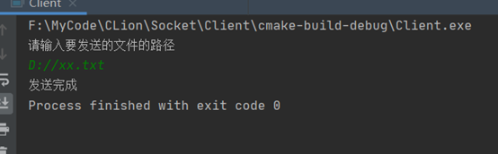
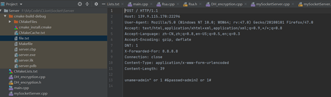

# 课设作业_基于socket的文件加密传输程序.md

### 公共内容

主要内容有实现的DH算法，RSA算法，这些都用C++类实现封装。仅注释接口，具体实现请看代码 

### 服务端

socket，用C++类实现封装

使main函数逻辑清晰

类mySocketServer.cpp,接口

Main函数

### 客户端

项目结构

Mysocket类

 

Main函数

### 附件：

[mkdocs-typora/Socket at main · 2608204644/mkdocs-typora (github.com)](https://github.com/2608204644/mkdocs-typora/tree/main/Socket)

### 运行

取D盘文件xx.txt

同时在本机上运行server跟client

Server：

Client：

服务端保存文件在项目目录下的file.txt

